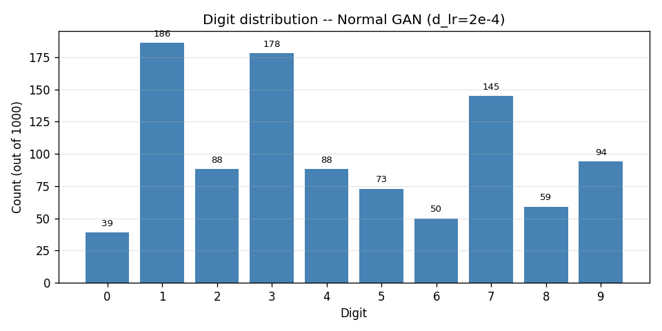
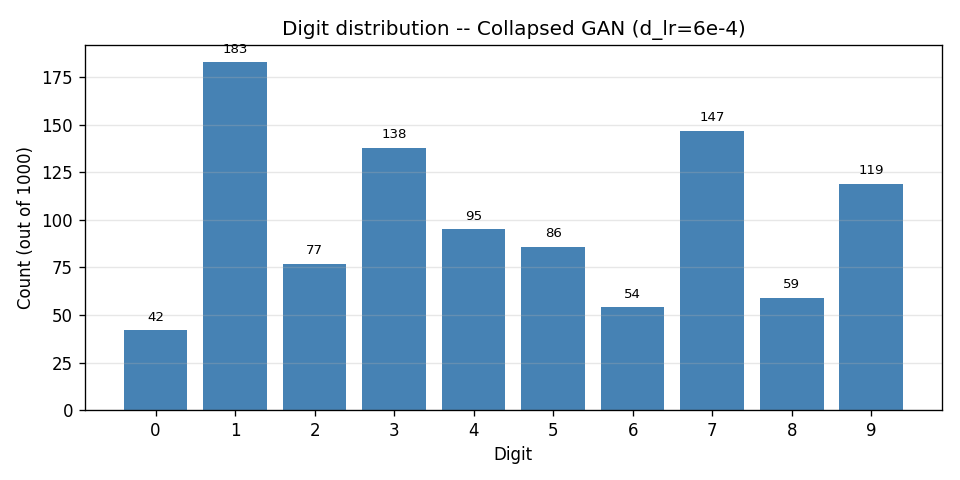
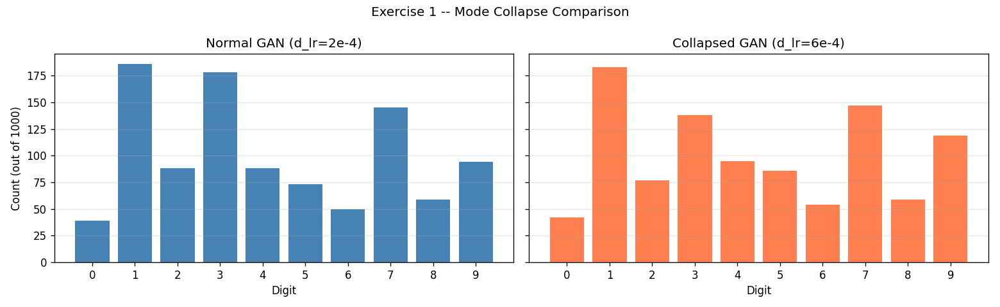
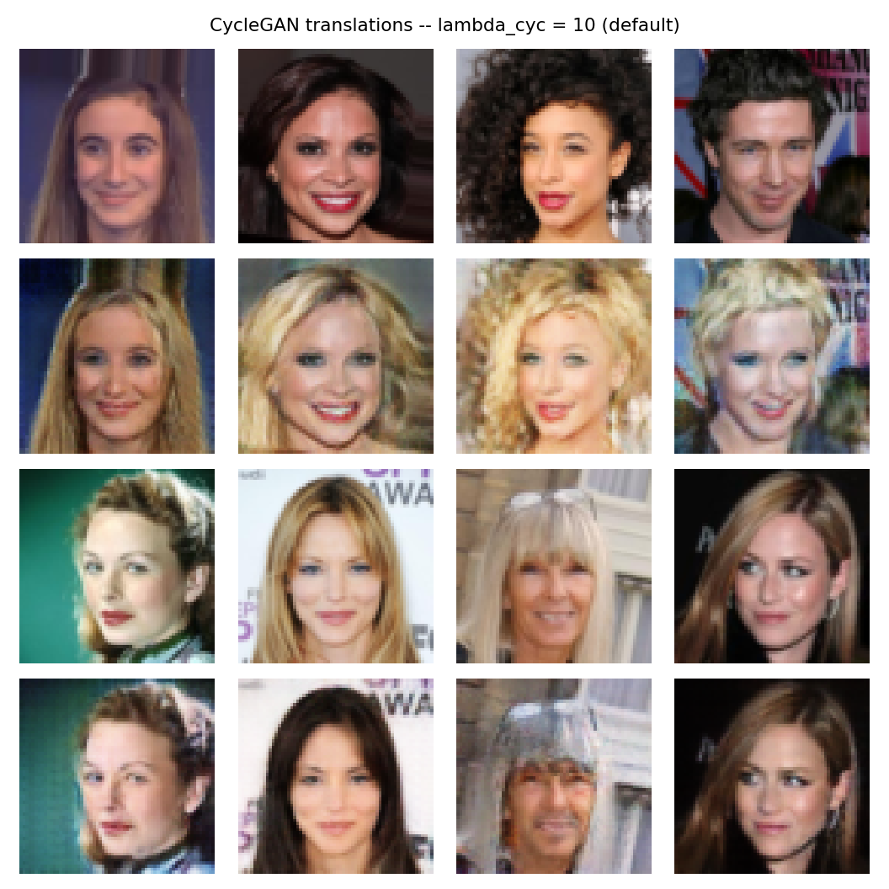
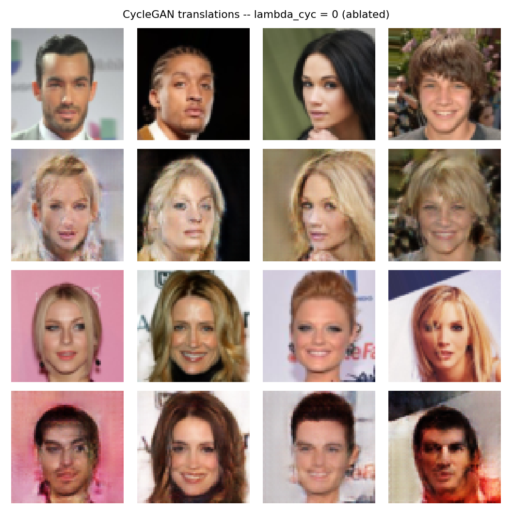
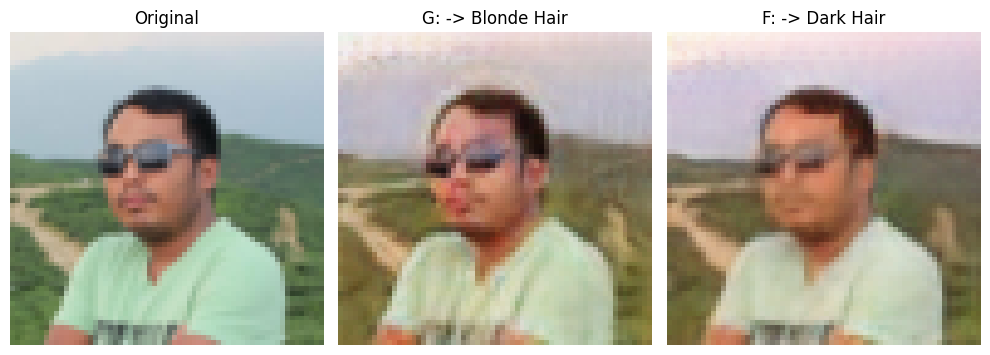
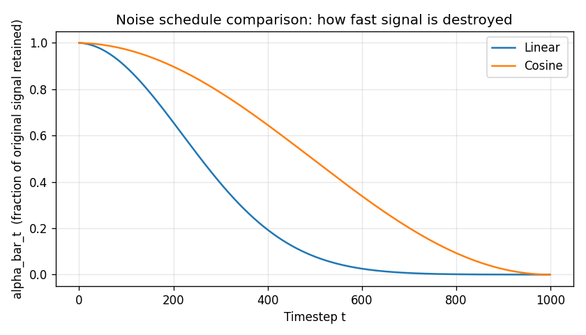
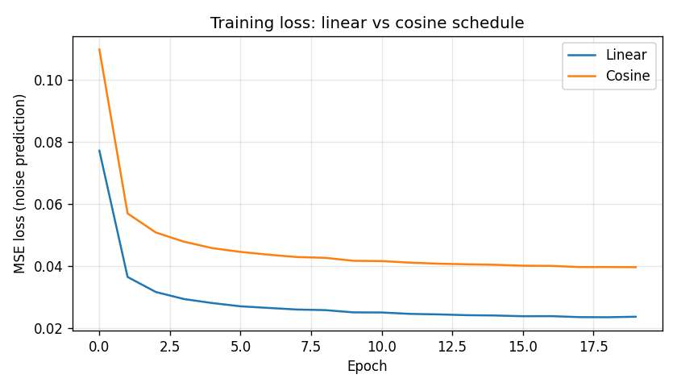
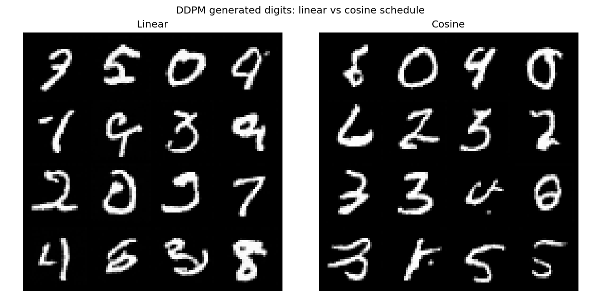

# A4 Generative Models

# Exercise 1: GAN Mode Collapse

## Commands used

```bash
# 1. Train the helper MNIST classifier (judge for digit classification)
python run.py --train-classifier --epochs 10

# 2. Train the normal GAN (part a)
python run.py --model gan --dataset mnist --epochs 20 --train --save-name gan_mnist_normal.pt

# 3. Train a deliberately destabilized GAN: 3x discriminator LR (part b)
python run.py --model gan --dataset mnist --epochs 20 --train --d_lr 6e-4 --save-name gan_mnist_collapsed.pt

# 4. Run the mode-collapse analysis (generates 1000 images per GAN, classifies, builds histograms)
python exercises/exercise1_mode_collapse.py
```

All training was run on GPU (`cuda`), ~1.4s/epoch for the GAN, 20 epochs total per run.

---

## Helper classifier results

A small CNN was trained on real, labeled MNIST (separate from the GAN) to act as a "judge" — it labels what digit a generated image looks like, since the GAN itself produces no labels.

| Epoch | Test accuracy |
|---|---|
| 9/10 | 0.9914 |
| 10/10 | 0.9911 |

Final test accuracy: **99.11%** — reliable enough to trust its labels when classifying GAN-generated digits.

---

## Part (a): Normal GAN — digit distribution

Trained with default learning rates (G: `2e-4`, D: `2e-4`), 20 epochs. 1000 images generated and classified.

| Digit | 0 | 1 | 2 | 3 | 4 | 5 | 6 | 7 | 8 | 9 |
|---|---|---|---|---|---|---|---|---|---|---|
| Count (out of 1000) | 39 | 186 | 88 | 178 | 88 | 73 | 50 | 145 | 59 | 94 |



**Coverage spread (max − min):** 147
**Standard deviation across digits:** 49.5

**Does the GAN cover all 10 digits evenly? No.** Every digit is represented (no digit hit zero), so there's no full mode collapse — but coverage is far from uniform. Digit `1` is heavily overrepresented (186, nearly 5x the rarest digit), while digit `0` is underrepresented (39). This is a mild, partial bias rather than catastrophic collapse: the generator has a few "easy" modes (1, 3, 7) it leans on more than others (0, 6, 8).

---

## Part (b): Intentionally destabilized GAN — 3x discriminator LR

Same setup, but discriminator LR set to `6e-4` (3x the default `2e-4`), to try to induce mode collapse.

| Digit | 0 | 1 | 2 | 3 | 4 | 5 | 6 | 7 | 8 | 9 |
|---|---|---|---|---|---|---|---|---|---|---|
| Count (out of 1000) | 42 | 183 | 77 | 138 | 95 | 86 | 54 | 147 | 59 | 119 |





**Coverage spread:** 141
**Standard deviation:** 43.4

**Which digits vanished?** None — every digit is still represented in both runs (no zero counts, no near-zero counts under 10 samples).

**Honest finding:** A 3x discriminator learning rate over 20 epochs was **not sufficient to induce visible mode collapse** on this run. The collapsed-attempt distribution is, by both metrics (spread and std-dev), marginally *more* even than the baseline — meaning the perturbation didn't push the generator toward dropping modes within this training budget. This is itself a useful experimental result: vanilla GAN mode collapse is not guaranteed to appear from a moderate learning-rate imbalance alone; it typically needs either a much larger imbalance (e.g. 10–20x), more training epochs for the discriminator's advantage to compound, or an unlucky initialization/seed. Both of these factors are stochastic, which is part of why GAN training is notoriously unstable and hard to reproduce exactly.

---

## Part (c): Two techniques to prevent mode collapse

**1. WGAN (Wasserstein GAN) with gradient penalty.** Vanilla GANs use a discriminator that outputs a bounded probability (via sigmoid + BCE loss), which can saturate and stop providing useful gradients once it gets too confident — this is one of the conditions that lets mode collapse take hold. WGAN replaces the discriminator with a "critic" that estimates the Wasserstein distance between real and generated distributions, an unbounded score rather than a probability. Combined with a gradient penalty (or weight clipping) enforcing a Lipschitz constraint, this produces smoother, non-saturating gradients throughout training, which keeps the generator receiving useful signal even late in training and makes it harder for the discriminator to "win" so decisively that the generator collapses onto a few safe outputs.

**2. Minibatch discrimination.** One root cause of mode collapse is that the discriminator judges each generated image in isolation — it has no way to notice "every image in this batch looks identical." Minibatch discrimination feeds the discriminator statistics computed *across* the whole batch (e.g., similarity between samples), so it can directly penalize batches that lack diversity, even if each individual fake image looks locally convincing. This gives the generator a direct incentive to produce a varied batch rather than repeatedly generating its single most-convincing output.

---

## Files generated (Exercise 1)

```
saved/
├── mnist_classifier.pt
├── gan_mnist_normal.pt
├── gan_mnist_collapsed.pt
├── exercise1_normal_hist.png
├── exercise1_collapsed_hist.png
└── exercise1_comparison.png
```

---

# Exercise 2: CycleGAN Ablation — Cycle Consistency

## Commands used

```bash
# 1. Train the default CycleGAN (paper's recommended weight)
python run.py --model cyclegan --dataset celeba --epochs 10 --train --batch-size 16 \
               --lambda_cyc 10 --save-name cyclegan_default.pt

# 2. Train the ablated CycleGAN (cycle consistency disabled)
python run.py --model cyclegan --dataset celeba --epochs 10 --train --batch-size 16 \
               --lambda_cyc 0 --save-name cyclegan_no_cycle.pt

# 3. Run the comparison analysis (4x4 translation grids for each setting)
python exercises/exercise2_cycle_ablation.py
```

CelebA was loaded via the Hugging Face Hub mirror (`flwrlabs/celeba`) rather than torchvision's
built-in Google Drive downloader, which repeatedly failed with a "too many users have viewed or
downloaded this file" quota error. Dataset split: 30,000 dark-hair images (domain X), 24,267
blonde-hair images (domain Y), via the `Blond_Hair` attribute. Both runs: 10 epochs, ~152s/epoch on GPU.

---

## Part (a): Visual quality comparison

| Setting | Visual quality | Face structure preserved? | Notes |
|---|---|---|---|
| λ_cyc = 10 (default) | High — clean, sharp | Yes, both directions | Backgrounds and identity consistently preserved in both dark→blonde and blonde→dark |
| λ_cyc = 0 (ablated) | Degraded, especially in one direction | G (dark→blonde) mostly preserved; F (blonde→dark) shows color bleeding and artifacts | Asymmetric breakdown — F "cheats" noticeably more than G |

**Training loss comparison** (generator loss, final epoch): λ_cyc=10 → **3.72**, λ_cyc=0 → **1.40**.
The lower loss for the ablated run is expected and not a quality signal — it simply reflects that
the dominant loss term (cycle consistency, weighted ×10) was removed entirely, not that the
translations got better.

---

## Part (b): Example translations from each setting

**Default (λ_cyc = 10):**



**Ablated (λ_cyc = 0):**



Each grid: row 1 = real dark-hair images, row 2 = dark→blonde translations (G), row 3 = real
blonde-hair images, row 4 = blonde→dark translations (F).

**Artifacts observed when cycle loss is removed:** In the ablated grid's row 4 (blonde→dark), the
background color visibly bleeds into the face and hair (e.g. pink background smearing into skin
in columns 1 and 4), producing blotchy reddish-orange artifacts that don't correspond to real hair
texture. Facial structure is also less crisply defined than in the default version's row 4, where
backgrounds (green, white/poster, building, black) and identity-specific details (e.g. sunglasses
pushed up on the head) are all cleanly preserved. The dark→blonde direction (row 2) degraded far
less under ablation — the breakdown is clearly asymmetric, hitting F harder than G in this run.

---

## Part (c): Why does removing cycle consistency cause the generator to "cheat"?

Cycle consistency is the only constraint that forces a translation to be *reversible* — that
`F(G(x)) ≈ x`. Without it, a generator only has to satisfy its discriminator's *local, patch-level*
judgment of "does this look like the target domain" (recall `PatchDiscriminator` only scores small
patches, not the whole image). That's a much weaker requirement than "produce an output that another
network can map back to the original" — it can be satisfied by shortcuts like smearing dark or
light tones across a region, including background pixels that have nothing to do with hair, rather
than learning a semantically meaningful, identity-preserving edit. In other words, the discriminator
only asks "does this patch look real," while cycle consistency is what forces the generator to also
ask "did I actually change *only* what I was supposed to, in a way that's undoable." Removing it
leaves the adversarial loss alone in charge, and adversarial loss alone is satisfied by texture
tricks the eye immediately spots as wrong, even when they technically reduce the loss faster (as
seen in the lower G loss for the ablated run).

---

## Files generated (Exercise 2)

```
saved/
├── cyclegan_default.pt
├── cyclegan_no_cycle.pt
├── exercise2_default_grid.png
└── exercise2_ablated_grid.png
```

---

# Exercise 3: Your Own Face — Style Transfer

## Command used

```bash
python run.py --model cyclegan --weights saved/cyclegan_default.pt --test-image my_face.jpg
```

(Used the default λ_cyc=10 checkpoint, since Exercise 2 confirmed it produces cleaner,
more structure-preserving translations than the ablated one.)

## Part (a): Result



`[original | G: -> blonde hair | F: -> dark hair]`

## Part (b): Did the model preserve face structure?

**Only partially.** The eyes/sunglasses region holds up reasonably well in both translations — position
and shape stay recognizable. The lower face, however, visibly distorts in the blonde-hair (G) output:
the mouth/chin area shows a melted, smudged quality not present in the original.

More strikingly, the **background was not preserved**. The original's green hillside, dirt road, and
blue sky get washed into a flat pastel/lavender tone across both translations, rather than staying
visually close to the input. This points to a gap in what the loss terms actually constrain: identity
loss (`λ_idt`) only directly penalizes `F(real_x) ≈ real_x` and `G(real_y) ≈ real_y` — i.e., when an
image is *already* in the correct domain and shouldn't change. It does **not** directly constrain what
happens to background pixels during an actual cross-domain translation (`G(x)` or `F(y)`); that's left
to cycle consistency to enforce indirectly, by requiring the whole transformation to be reconstructable.
For a background type the model never saw in training (outdoor hills/road vs. CelebA's mostly indoor
studio/red-carpet backdrops), neither loss term gave it a reliable prior, so it defaulted to a generic
color-shift wash over the whole frame instead of a localized, structure-preserving edit.

## Part (c): Expectation vs. what was observed

CelebA is composed almost entirely of cropped celebrity headshots — indoor or red-carpet settings,
consistent studio-style lighting, no sunglasses or outdoor scenery, and a demographic skew typical of
2015-era Western celebrity photography. A photo that differs substantially from this distribution
(outdoor natural background, sunglasses, different lighting, different ethnicity/age range than the
training set's skew) was expected to produce a **noticeably worse** translation than the in-distribution
CelebA test images seen in Exercise 2 — this is the classic generalization gap GANs have outside their
training distribution.

**This was confirmed.** Compared to the clean Exercise 2 results on real CelebA test photos, this
translation shows visible structural distortion (the melted mouth/chin in the blonde output) and a
complete failure to preserve the actual background content, instead replacing it with a generic
pastel wash. The sunglasses — an accessory essentially absent from CelebA — also came through
blurred rather than crisply preserved. This is a concrete illustration of CycleGAN's narrow
generalization: it learns a transformation tightly coupled to the visual statistics of its specific
training distribution, and degrades quickly once an input photo departs from that distribution in
background, accessories, or framing.

## Files generated (Exercise 3)

```
saved/
└── cyclegan_my_face_result.png
```

---

# Exercise 4: DDPM Noise Schedule Ablation — Linear vs Cosine

## Commands used

```bash
python run.py --model ddpm --dataset mnist --epochs 20 --schedule linear --train \
               --save-name ddpm_mnist_linear.pt

python run.py --model ddpm --dataset mnist --epochs 20 --schedule cosine --train \
               --save-name ddpm_mnist_cosine.pt

python exercises/exercise4_ddpm_schedule.py
```

1000 timesteps, 20 epochs, batch size 128, GPU. Both trained in ~150s total (~7.6s/epoch) — far
faster per-epoch than either GAN, since DDPM training has no adversarial back-and-forth, just a
single network learning to predict noise via plain MSE loss.

---

## Part (a): Schedule shapes and training loss



The cosine schedule retains more signal (higher ᾱ_t) through the middle of the trajectory and drops
off more sharply near the end, compared to linear's steadier decay — exactly as intended by the
Nichol & Dhariwal cosine schedule design.



| Schedule | Final epoch loss (MSE) |
|---|---|
| Linear | 0.0404 |
| Cosine | **0.0394** |

By training loss alone, cosine looks marginally *better*. As the next section shows, this metric is
misleading on its own.

---

## Part (b): Generated samples — and a real numerical-stability discovery

**Initial result:** the linear schedule produced clearly recognizable digits immediately. The cosine
schedule, despite its lower training loss, produced **pure static** — every generated image was
unstructured noise, not digits.

**Root cause.** The naive DDPM reverse-sampling formula divides by `sqrt(alpha_t)` at every step:
```python
mean = (1 / sqrt(alpha_t)) * (x - coef * pred_noise)
```
The cosine schedule's construction forces its final beta toward the clipping ceiling (~0.999),
making the corresponding `alpha_t` tiny. Dividing by `sqrt(alpha_t)` there amplifies any small
noise-prediction error by ~30-100x in a single step, and that corrupted result propagates through
every subsequent step. The linear schedule never hits this regime (its betas stay capped at a gentle
`0.02` throughout), which is why it sampled cleanly from the start.

**Fix applied.** Replaced the naive formula with the standard, numerically safer approach used in
practice (e.g. Hugging Face `diffusers`): reconstruct the model's predicted clean image (`x0_pred`),
**clip it to `[-1, 1]`**, then compute the next step as a weighted blend of `x0_pred` and the current
noisy image via the proper DDPM posterior formula, rather than dividing directly by `sqrt(alpha_t)`.

**Result after the fix — a second, more interesting finding.** The fix made clean digit generation
*possible* for cosine, but **not reliable**. Running generation twice from the identical cosine
checkpoint, with no other change, produced two different outcomes — one full batch of clean digits,
and a separate run with the same checkpoint collapsing into noise. Confirmed directly:

```
imgs1 mean/std: -0.690, 0.662
imgs2 mean/std: -0.764, 0.582
Identical? False
```

So the cosine-trained model **can** denoise correctly, but is highly sensitive to its starting noise
draw — some random seeds land in a trajectory that converges cleanly, others diverge. The linear
schedule showed no such sensitivity across repeated runs.



---

## Part (c): Discussion — what this reveals about the two schedules

Training loss is not a reliable proxy for sample quality in diffusion models. Cosine achieved a
*lower* loss than linear, yet produced *less reliable* samples — because MSE loss on noise prediction
only measures local accuracy at each individual timestep, never the stability of the full multi-step
reverse chain those local predictions get composed into. A schedule that pushes `alpha_t` toward
extreme values (as cosine's final steps do, by construction) creates a regime where the reverse
process is inherently more sensitive to small prediction errors, regardless of how low the average
training loss is. In production diffusion systems, the cosine schedule is typically paired with
additional stabilizers this simple implementation doesn't include — longer training, EMA-averaged
model weights, and often a different parameterization (e.g. predicting the clean image or a velocity
term instead of raw noise) that further reduces sensitivity at these extreme steps. Here, with a
small UNet trained for only 20 epochs and the most direct possible parameterization, that extra
stability wasn't present, which is exactly what exposed the instability in this exercise.

## Files generated (Exercise 4)

```
saved/
├── ddpm_mnist_linear.pt
├── ddpm_mnist_cosine.pt
├── exercise4_schedules_comparison.png
├── exercise4_loss_comparison.png
└── exercise4_samples_comparison.png
```

---

# Overall Summary

| Model | Visual quality | Training time | Key finding |
|---|---|---|---|
| Vanilla GAN (MNIST) | Moderate — uneven digit coverage, no full collapse | ~1.4s/epoch | Uneven mode coverage by default; 3x discriminator LR alone wasn't enough to force full collapse in 20 epochs |
| CycleGAN (CelebA hair color) | High with full loss; degraded/asymmetric without cycle consistency | ~152s/epoch | Cycle consistency is what prevents the generator from "cheating" via background color bleeding |
| DDPM — Linear schedule | High, consistent across runs | ~7.6s/epoch | Reliable, stable sampling throughout training |
| DDPM — Cosine schedule | Inconsistent — sometimes clean, sometimes pure noise from the same checkpoint | ~7.6s/epoch | Lower training loss did not mean better or more reliable samples; numerically fragile at extreme schedule steps |

## When would you use GAN vs CycleGAN vs Diffusion in practice?

**GANs** are the right choice when you need fast inference (a single forward pass) and have a clear,
unconditional generation target — but expect to fight mode collapse and training instability, and to
need careful tuning or architectural tricks (WGAN, minibatch discrimination) to get reliable coverage.
**CycleGAN** is specifically suited to unpaired image-to-image translation tasks (style transfer,
domain adaptation) where matched before/after pairs don't exist, but it generalizes narrowly to the
training distribution and needs cycle consistency to avoid producing convincing-looking but
semantically wrong translations. **Diffusion models** trade GANs' fast single-pass inference for
slower, multi-step sampling, but in return offer training stability (no adversarial dynamics, just
regression on noise) and, with enough timesteps and a well-tuned schedule, typically higher and more
diverse sample fidelity — making them the better default for high-quality unconditional or
conditional generation when inference latency is less critical than output quality and training
reliability, as long as the schedule and sampling formula are implemented carefully (this exercise
being a direct demonstration of why that care matters).